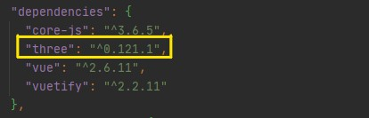

==============================
Vuetify and Three.js
==============================
This project shows a basic concept of Vuetify
and Three.js in detail and describes how they are linked together.

Introduction
------------------------------
Vuetify is a reusable semantic component framework for Vue.js
that aims to provide clean, semantic, and reusable components.

Three.js is a cross-browser JavaScript library and application
programming interface (API) used to create and display animated 3D
computer graphics in a web browser using WebGL.

It is assumed that you know a little about Vuetify and Three.js.
If not, visit `Vuetify <https://vuetifyjs.com/en/introduction/why-vuetify/`_ and also
`Three.js Fundamentals<https://threejsfundamentals.org/>`__ to learn more.

Project setup
-------------------------------
* Install `Vue.js<https://vuejs.org/v2/guide/installation.html>`__:

.. code-block:: bash
   :linenos:

    npm install vue

* Create a new project folder by Vue.js:
     * Check `Creating a Project<https://cli.vuejs.org/guide/creating-a-project.html#vue-create>`__ to become more familiar.

.. code-block:: bash
   :linenos:

    vue create (foldername)

* Then go to the project folder and add Vuetify:

.. code-block:: bash
   :linenos:

    cd (foldername)
    vue add vuetify

* Run serve:

.. code-block:: bash
   :linenos:

    npm run serve

Start the project
----------------------------------
The App.vue file, the main component of the project has already
been made automatically. A new child component should be created
in the component folder to hold the three.js rotating cube.

`Components<https://v1.vuejs.org/guide/components.html#What-are-Components>`__: They are
one of the most powerful features of Vue.js. They help you extend basic HTML elements to
encapsulate reusable code. At a high level, Components are custom elements that Vue.js
compiler would attach a specified behavior to.

The next step is to register the new child component inside the
App.vue(parent/main component). This app.vue file is an example
to shows how to register your child component:

To make a three.js rotating cube we need to install three.js library.
Run the following command in your terminal:

.. code-block:: bash
   :linenos:

   npm install three

After installation you will see three.js in the package.json file like the following picture:

